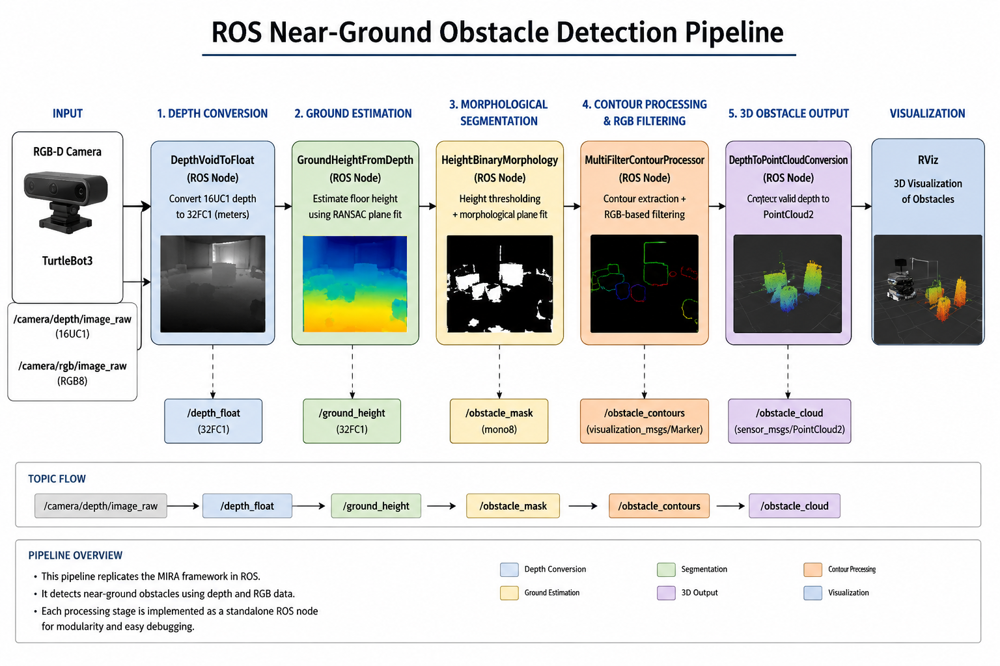
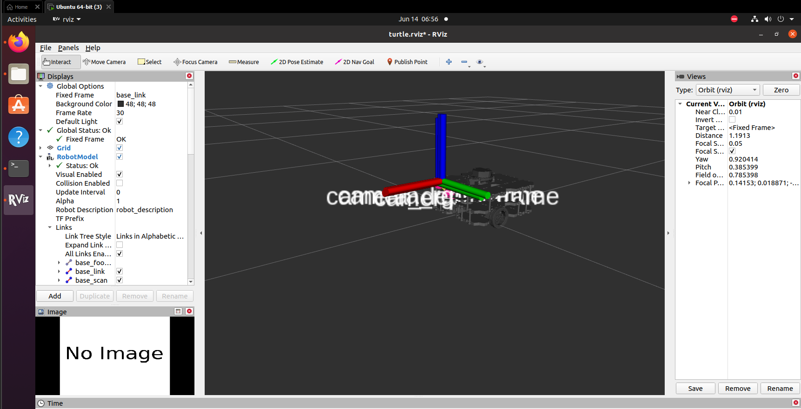
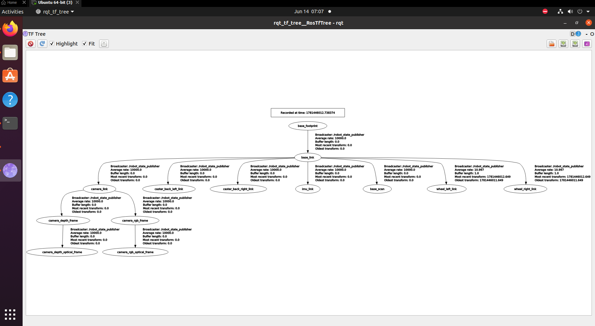

# ros-near-ground-obstacle-detection
# ROS Near-Ground Obstacle Detection

ROS reimplementation of an RGB-assisted near-ground obstacle detection framework originally developed for the TORY robot using the MIRA robotics framework.

This project converts the core perception pipeline from the original MIRA-based implementation into ROS nodes, enabling obstacle detection using RGB-D sensor data, floor-plane estimation, obstacle segmentation, RGB-assisted filtering, and 3D point cloud generation.

---

## Project Overview

Near-ground obstacles such as clothing, cables, small objects, and floor-level hazards are difficult to detect using conventional navigation systems.

This project implements a perception pipeline that:

- Processes depth images from an RGB-D sensor
- Estimates the floor plane using RANSAC
- Computes pixel-wise height above ground
- Segments potential obstacles
- Refines detections using RGB information
- Generates a 3D obstacle point cloud for visualization

The implementation is inspired by the author's M.Eng. thesis work on the TORY service robot.

---

## Original MIRA Pipeline

The original system was developed using the MIRA robotics framework.

```text
DepthVoidToFloat
        ↓
GroundHeightFromDepth
        ↓
HeightBinaryMorphology
        ↓
MultiFilterContourProcessor
        ↓
DepthToPointCloudConversion
```

---

## ROS Reimplementation

The same processing stages have been redesigned as ROS nodes.

```text
/camera/depth/image_raw
                │
                ▼
DepthVoidToFloat
                │
                ▼
/depth_float
                │
                ▼
GroundHeightFromDepth
                │
                ▼
/ground_height
                │
                ▼
HeightBinaryMorphology
                │
                ▼
/height_binary_mask
                │
                ├─────────────────────┐
                │                     │
                │                     ▼
                │          /camera/rgb/image_raw
                │                     │
                └──────────────► MultiFilterContourProcessor
                                        │
                                        ▼
                             /filtered_cloth_mask
                                        │
                                        ▼
                              MaskToPointCloud
                                        │
                                        ▼
                            /obstacle_pointcloud
                                        │
                                        ▼
                                      RViz
```

---

## System Architecture

### ROS Pipeline



### MIRA vs ROS Comparison


---

## Implemented ROS Nodes

### 1. DepthVoidToFloat

**Input**

```text
/camera/depth/image_raw
```

**Output**

```text
/depth_float
```

Converts raw depth images from 16-bit unsigned integer format (16UC1) into floating-point depth images (32FC1) while handling invalid measurements.

---

### 2. GroundHeightFromDepth

**Input**

```text
/depth_float
```

**Output**

```text
/ground_height
```

Functions:

- Pixel-to-3D conversion
- RANSAC floor plane estimation
- Least-squares plane refinement
- Height-above-ground computation

---

### 3. HeightBinaryMorphology

**Input**

```text
/ground_height
```

**Outputs**

```text
/height_binary_mask
/height_contours
```

Functions:

- Height thresholding
- Floor noise removal
- Contour extraction
- Area-based contour filtering

---

### 4. MultiFilterContourProcessor

**Inputs**

```text
/height_binary_mask
/camera/rgb/image_raw
```

**Output**

```text
/filtered_cloth_mask
```

Functions:

- RGB-assisted filtering
- HSV color analysis
- Floor color learning
- K-Means clustering
- Temporal persistence filtering

---

### 5. MaskToPointCloud

**Inputs**

```text
/filtered_cloth_mask
/depth_float
```

**Output**

```text
/obstacle_pointcloud
```

Functions:

- Obstacle mask projection
- 3D point generation
- PointCloud2 publishing
- RViz visualization

---

## Repository Structure

```text
ros-near-ground-obstacle-detection
│
├── src
│   ├── depth_void_to_float_node.cpp
│   ├── ground_height_from_depth_node.cpp
│   ├── height_binary_morphology_node.cpp
│   ├── multi_filter_contour_processor_node.cpp
│   └── mask_to_pointcloud_node.cpp
│
├── launch
│   ├── depth_void_to_float.launch
│   ├── ground_height.launch
│   ├── segmentation.launch
│   └── full_pipeline.launch
│
├── config
│   └── pipeline.yaml
│
├── rviz
│   └── turtle.rviz
│
├── docs
│   ├── architecture
│   │   ├── ros_pipeline.png
│   │   └── ros_vs_mira.png
│   │
│   └── screenshots
│       ├── turtlebot3_rviz.png
│       ├── tf_tree.png
│       ├── depth_void_to_float_result.png
│       ├── ground_height_result.png
│       ├── binary_mask_result.png
│       └── pointcloud_result.png
│
├── CMakeLists.txt
├── package.xml
├── LICENSE
└── README.md
```

---

## RViz Visualization

### Robot Model



### TF Tree



---

## Build Instructions

### Create Workspace

```bash
mkdir -p ~/ros_obstacle_ws/src
cd ~/ros_obstacle_ws
catkin_make
```

### Clone Repository

```bash
cd ~/ros_obstacle_ws/src

git clone https://github.com/YOUR_USERNAME/ros-near-ground-obstacle-detection.git
```

### Build

```bash
cd ~/ros_obstacle_ws

catkin_make

source devel/setup.bash
```

---

## Running the Pipeline

### Start ROS

```bash
roscore
```

### Run Individual Nodes

```bash
rosrun rgb_assisted_obstacle_detection depth_void_to_float_node

rosrun rgb_assisted_obstacle_detection ground_height_from_depth_node

rosrun rgb_assisted_obstacle_detection height_binary_morphology_node

rosrun rgb_assisted_obstacle_detection multi_filter_contour_processor_node

rosrun rgb_assisted_obstacle_detection mask_to_pointcloud_node
```

### Launch Complete Pipeline

```bash
roslaunch rgb_assisted_obstacle_detection full_pipeline.launch
```

---

## ROS Topics

| Topic | Type | Description |
|---------|---------|---------|
| `/camera/depth/image_raw` | Image | Raw depth image |
| `/depth_float` | Image | Float depth image |
| `/ground_height` | Image | Height-above-ground map |
| `/height_binary_mask` | Image | Binary obstacle mask |
| `/height_contours` | Image | Contour visualization |
| `/filtered_cloth_mask` | Image | RGB-assisted filtered mask |
| `/obstacle_pointcloud` | PointCloud2 | Final obstacle point cloud |

---

## Current Status

### Completed

- ROS package setup
- TurtleBot3 visualization in RViz
- TF tree generation
- DepthVoidToFloat conversion
- GroundHeightFromDepth conversion
- HeightBinaryMorphology conversion
- MultiFilterContourProcessor conversion
- MaskToPointCloud conversion

### In Progress

- RGB image publisher integration
- Dataset testing
- Point cloud validation
- RViz result visualization

---

## Future Work

- Real RGB-D camera integration
- ROS bag dataset support
- Gazebo simulation integration
- Digital twin development
- Real-time obstacle avoidance
- Full TORY robot simulation
- ROS2 migration

---

## Thesis Background

This project is derived from research conducted for an M.Eng. thesis focused on RGB-assisted near-ground obstacle detection for the TORY service robot.

The original implementation was developed in the MIRA robotics framework and targeted reliable detection of small floor-level obstacles using RGB-D sensing.

---

## Author

**Zameer Hussain**

M.Eng. Autonomous Systems

Hochschule Schmalkalden, Germany

---

## License

This project is released under the MIT License.
